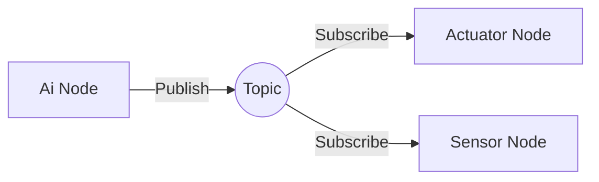

# Chapter 2: ROS 2 as Middleware for Physical AI Systems

## Introduction to Middleware Concepts

Middleware is software that provides common services and capabilities to applications outside of what's offered by the operating system. In the context of robotics, middleware acts as a communication layer that enables different components of a robotic system to interact seamlessly.

ROS 2 serves as middleware by providing:

- **Communication abstraction**: Hiding the complexity of network protocols and data serialization
- **Service discovery**: Allowing components to find and connect with each other automatically
- **Message routing**: Managing the flow of data between different parts of the system
- **Platform independence**: Enabling the same code to run on different hardware and operating systems

## How ROS 2 Facilitates Communication Between AI and Robots

### Node Architecture

In ROS 2, all components of a robotic system are organized as **nodes**. Each node can be thought of as a process that performs computation. Nodes are designed to be modular and can be run on the same or different devices.

- **AI Nodes**: Process data, make decisions, plan actions
- **Sensor Nodes**: Interface with physical sensors, publish sensor data
- **Actuator Nodes**: Interface with physical actuators, execute commands
- **Middleware Layer**: ROS 2 runtime that handles communication between nodes

### Communication Patterns

ROS 2 provides several communication patterns that are essential for connecting AI to physical systems:

#### Topics (Publish/Subscribe)


Topics enable one-way communication where data flows from publishers to subscribers. This is ideal for:
- Sensor data streams (camera images, LIDAR scans)
- Robot state information
- Broadcast messages

#### Services (Request/Response)
Services provide synchronous communication for:
- Requesting specific actions
- Getting current status
- Configuration changes

#### Actions (Goal/Feedback/Result)
Actions are perfect for long-running tasks with:
- Goal specification
- Continuous feedback during execution
- Final result reporting

### Quality of Service (QoS) Settings

ROS 2 provides Quality of Service settings that allow you to control communication behavior:

- **Reliability**: Reliable (guaranteed delivery) or Best Effort (no guarantee)
- **Durability**: Whether late-joining subscribers get old messages
- **History**: How many messages to keep for late joiners
- **Deadline**: Maximum time between consecutive messages

These settings are crucial for connecting AI systems (which may be tolerant of some data loss) with safety-critical physical systems (which require guaranteed delivery).

## ROS 2 as the Communication Layer

### The Data Distribution Service (DDS)

ROS 2 uses DDS (Data Distribution Service) as its underlying communication middleware. DDS provides:

- **Decentralized communication**: No central master node that can fail
- **Discovery**: Automatic detection of nodes on the network
- **Configuration**: Runtime configuration of communication behavior
- **Security**: Authentication, access control, and encryption

### Message Types and Interfaces

ROS 2 defines standard message types for common robotic data:

- **Sensors**: sensor_msgs package (images, laser scans, IMU data)
- **Geometry**: geometry_msgs package (poses, transforms, vectors)
- **Navigation**: nav_msgs package (paths, maps, odometry)
- **Actions**: action_msgs package (goals, feedback, results)

These standardized interfaces make it possible to connect AI algorithms to different robot platforms without code changes.

## Practical Examples of AI-to-Robot Connections

### Example 1: Object Detection and Grasping

```
Camera Node (sensor_msgs/Image)
    ↓ (publish to topic)
AI Perception Node (detects objects)
    ↓ (publish object locations)
Planning Node (geometry_msgs/Pose)
    ↓ (send action goal)
Arm Controller Node (execute grasp)
    ↓ (feedback/result)
```

### Example 2: Autonomous Navigation

```
LIDAR Node (sensor_msgs/LaserScan)
    ↓ (publish to topic)
AI Mapping Node (builds map)
    ↓ (publish map)
Path Planning Node (nav_msgs/Path)
    ↓ (send navigation goal)
Navigation Controller (execute path)
    ↓ (feedback on progress)
```

### Example 3: Human-Robot Interaction

```
Speech Recognition Node (std_msgs/String)
    ↓ (publish command)
AI Decision Node (processes command)
    ↓ (publish robot action)
Robot Action Node (execute behavior)
    ↓ (feedback on execution)
```

## Exercises for Learners

1. **Node Discovery Exercise**: Create two simple nodes - one publisher and one subscriber - and observe how they discover each other automatically.

2. **Message Passing Exercise**: Implement a simple sensor node that publishes data and an AI node that processes it to make a decision.

3. **QoS Configuration Exercise**: Experiment with different QoS settings and observe how they affect communication reliability and performance.

4. **Integration Challenge**: Connect a simple AI algorithm (like a basic decision tree) to control a simulated robot's behavior.

## Key Takeaways

- ROS 2's middleware architecture enables seamless communication between AI algorithms and physical robot systems
- The node-based architecture promotes modularity and reusability
- Multiple communication patterns serve different needs (streaming, synchronous, long-running)
- Quality of Service settings allow fine-tuning for specific requirements
- Standard message types enable code reusability across different robot platforms

## Learning Objectives

By the end of this chapter, you should be able to:
- Explain how ROS 2 functions as middleware between AI and physical systems
- Identify the different communication patterns in ROS 2 and their use cases
- Understand Quality of Service settings and their impact on communication
- Describe the role of DDS in ROS 2's architecture
- Implement basic node-to-node communication patterns